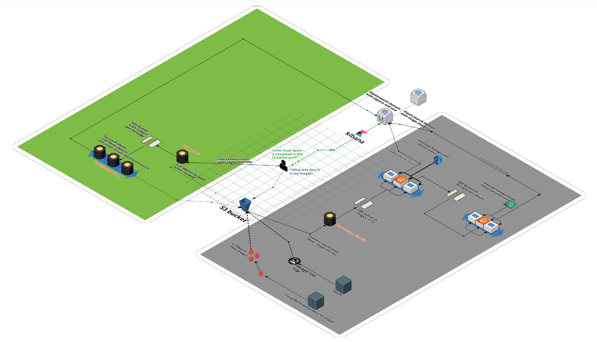

# s3workflow
 Analyze images in S3 bucket and gather object size total for a prefix

## Purpose: 

The project combines 2 goals: 
- Processing images using Rekognition 
- Calculate the total size of S3 objects given a prefix

## Deployment
 TBS - using the AWS CDK
 
 
 ## Costs
 TBS - using Cost Allocation Tags

