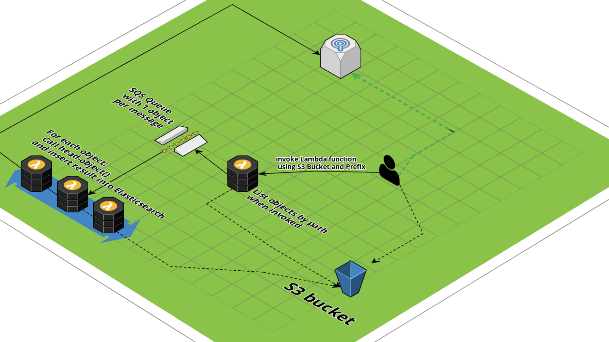

# s3workflow
Gather object size total for a prefix

## Purpose: 

The branch has 1 goal: 
- Calculate the total size of S3 objects given a prefix

## Deployment

1. Clone the code
2. cd s3workflow/cdk
3. source .venv/bin/activate
4. pip install -r requirements.txt
	- cdk synth >> hunter_list_bucket_only.cf (if you prefer to only generate the Cloudformation template)
6. cd list_objects
7. pip install -r requirements.txt -t .
8. cd ../get_size_and_store
9. pip install -r requirements.txt -t .
10. cd ..
11. cdk init
12. cdk deploy
 
 
 ## Costs
 TBS - using Cost Allocation Tags

